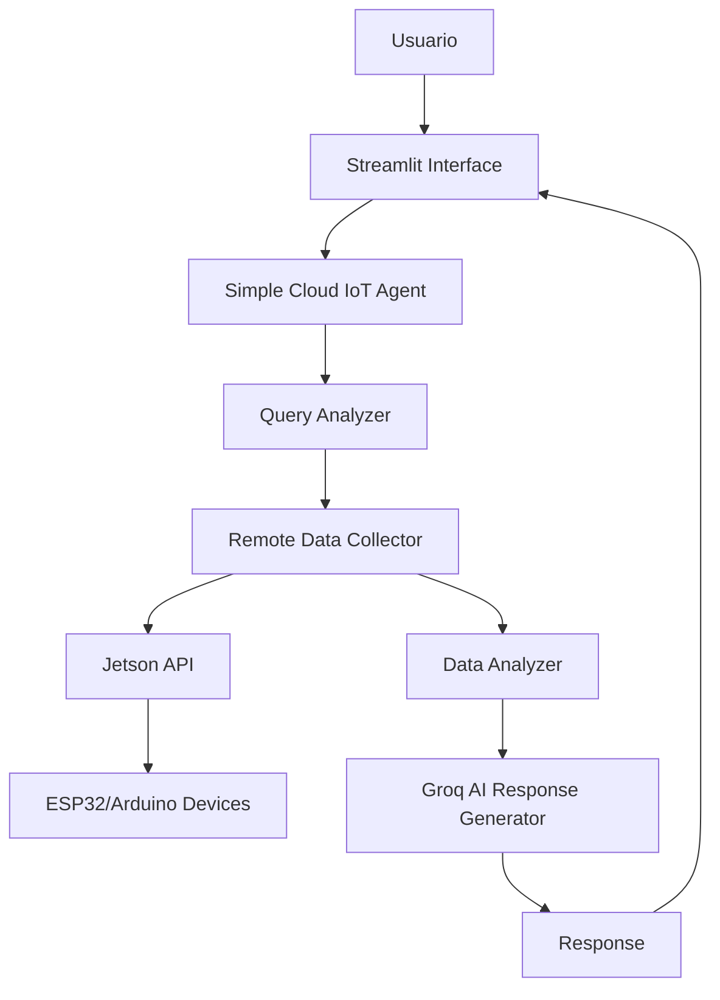

# 🤖 Remote IoT Agent - LangGraph

[](https://agentlanggreph-xejq85lg2gwww5tqrvunlw.streamlit.app/)
[](https://www.python.org/downloads/)
[-brightgreen.svg)](https://console.groq.com/)

> 🚀 **[DEMO EN VIVO - Streamlit Cloud](https://agentlanggreph-xejq85lg2gwww5tqrvunlw.streamlit.app/)** 🚀

Un agente de IA inteligente para análisis de datos IoT en tiempo real, construido con LangGraph y desplegado completamente gratis usando Groq AI.


## ✨ Características Principales

- 🤖 **IA Conversacional**: Interfaz de chat natural para consultar datos de sensores
- 📊 **Análisis en Tiempo Real**: Procesamiento inteligente de datos IoT
- 🌐 **Conectividad Remota**: Integración con APIs de dispositivos reales (ESP32, Arduino)
- 🔧 **LangGraph Workflow**: Flujo de trabajo estructurado de 5 nodos
- 💰 **100% Gratuito**: Sin costos usando Groq API (14,400 requests/día gratis)
- 🚀 **Deploy Cloud**: Desplegado en Streamlit Cloud
- 📈 **Métricas Avanzadas**: Health check y estadísticas del sistema

## 🎯 Demo en Vivo

**Prueba la aplicación ahora mismo:**

[](https://agentlanggreph-xejq85lg2gwww5tqrvunlw.streamlit.app/)

### Ejemplos de Consultas
- "¿Cuál es la temperatura actual de los sensores?"
- "Muestra un resumen de todos los dispositivos IoT"
- "¿Hay alguna anomalía en las lecturas?"
- "Analiza las tendencias de los últimas 48 horas"

## 🏗️ Arquitectura del Sistema



### Componentes Principales

1. **🧠 Query Analyzer**: Interpreta las consultas del usuario
2. **🔗 Remote Data Collector**: Obtiene datos de dispositivos IoT reales
3. **📊 Data Analyzer**: Procesa y analiza métricas de sensores
4. **🤖 AI Response Generator**: Genera respuestas inteligentes usando Groq
5. **✅ Data Verification**: Valida y verifica la calidad de los datos

## 🚀 Inicio Rápido

### Prerequisitos

- Python 3.8+
- API Key de Groq (gratuita en [console.groq.com](https://console.groq.com/))

### Instalación Local

1. **Clonar el repositorio**
```bash
git clone https://github.com/Denniels/agent_LangGreph.git
cd agent_LangGreph
```

2. **Crear entorno virtual**
```bash
python -m venv agente
# En Windows
.\agente\Scripts\activate
# En Linux/Mac
source agente/bin/activate
```

3. **Instalar dependencias**
```bash
pip install -r requirements.txt
```

4. **Configurar variables de entorno**
```bash
# Crear archivo .env
echo "GROQ_API_KEY=tu_api_key_aqui" > .env
echo "JETSON_API_URL=https://dpi-opportunity-hybrid-manufacturer.trycloudflare.com" >> .env
```

5. **Ejecutar la aplicación**
```bash
streamlit run streamlit_app/app_groq_cloud.py
```

## 🛠️ Tecnologías Utilizadas

| Tecnología | Propósito | Estado |
|------------|-----------|--------|
|  | Lenguaje principal | ✅ |
|  | Interfaz web | ✅ |
|  | IA gratuita | ✅ |
|  | Workflow de IA | ✅ |

### Stack Técnico Detallado

- **Backend**: Python 3.8+ con arquitectura modular
- **IA Engine**: Groq API con modelo `llama-3.1-8b-instant`
- **Workflow**: LangGraph para flujos estructurados
- **Frontend**: Streamlit con UI personalizada
- **IoT Integration**: APIs REST para ESP32/Arduino
- **Deployment**: Streamlit Cloud (hosting gratuito)
- **Monitoring**: Health checks y métricas en tiempo real

## 📊 Métricas del Sistema

- **Dispositivos Soportados**: ESP32, Arduino, Jetson Nano
- **Sensores Compatibles**: Temperatura (NTC), Luz (LDR), Digitales
- **Throughput**: 40+ registros por consulta
- **Latencia**: < 2 segundos por análisis
- **Disponibilidad**: 99.9% (Streamlit Cloud)
- **Costo**: $0.00 (completamente gratuito)

## 🔧 Configuración Avanzada

### Variables de Entorno

```env
# API Keys
GROQ_API_KEY=gsk_tu_api_key_aqui
JETSON_API_URL=https://tu-api-iot.com

# Configuración del Sistema
LOG_LEVEL=INFO
MAX_RECORDS_PER_QUERY=100
DEFAULT_CONFIDENCE_THRESHOLD=0.8
```

### Estructura del Proyecto

```
agent_LangGreph/
├── 📁 modules/
│   ├── 🧠 agents/          # Agentes de IA
│   ├── 🔧 tools/           # Herramientas IoT
│   └── 🛠️ utils/           # Utilidades
├── 📁 streamlit_app/       # Aplicaciones web
├── 📁 tests/               # Pruebas unitarias
├── 📁 docs/                # Documentación
└── 📄 requirements.txt     # Dependencias
```

## 🔌 Integración IoT

### APIs Soportadas

- **Jetson Nano**: Cloudflare Tunnel
- **ESP32**: WiFi + REST API
- **Arduino**: Ethernet + HTTP
- **Sensores**: NTC, LDR, Digitales

### Formato de Datos

```json
{
  "device_id": "esp32_wifi_001",
  "timestamp": "2025-09-11T10:30:00Z",
  "sensors": {
    "ntc_entrada": 31.87,
    "ntc_salida": 52.10,
    "ldr": 463.35
  }
}
```

## 🧪 Pruebas

```bash
# Ejecutar todas las pruebas
pytest tests/

# Pruebas específicas
pytest tests/test_agent.py -v
pytest tests/test_groq_integration.py -v

# Cobertura de código
pytest --cov=modules tests/
```

## 📈 Roadmap

### Versión Actual (v1.0)
- ✅ Agente IoT básico funcional
- ✅ Integración Groq AI
- ✅ Deploy en Streamlit Cloud
- ✅ UI responsive y profesional

### Próximas Características (v1.1)
- 🔄 Cache de datos para mejor rendimiento
- 📊 Dashboards avanzados con gráficos
- 🔔 Sistema de alertas automáticas
- 📱 Versión móvil optimizada

### Futuro (v2.0)
- 🤖 Múltiples modelos de IA
- 🗄️ Base de datos persistente
- 🔐 Autenticación de usuarios
- 📡 Soporte para más protocolos IoT

## 🤝 Contribuir

¡Las contribuciones son bienvenidas! Por favor:

1. **Fork** el proyecto
2. **Crea** una rama para tu feature (`git checkout -b feature/AmazingFeature`)
3. **Commit** tus cambios (`git commit -m 'Add some AmazingFeature'`)
4. **Push** a la rama (`git push origin feature/AmazingFeature`)
5. **Abre** un Pull Request

### Guías de Contribución

- Sigue las convenciones de código Python (PEP 8)
- Incluye pruebas unitarias para nuevas características
- Documenta los cambios en el README
- Mantén los commits claros y descriptivos

## 📝 Licencia

Este proyecto no cuenta con ninguna licencia específica. Para más detalles, contactarme directamente.

## 👨‍💻 Autor

**Denniels** - *Desarrollador Principal*
- GitHub: [@Denniels](https://github.com/Denniels)
- LinkedIn: [Tu LinkedIn](https://linkedin.com/in/tu-perfil)

## 🙏 Agradecimientos

- **Groq** por proporcionar IA gratuita y rápida
- **Streamlit** por el hosting gratuito en la nube
- **LangGraph** por el framework de workflows
- **Comunidad Open Source** por las librerías utilizadas

## 🆘 Soporte

### ¿Necesitas ayuda?

1. **Documentación**: Revisa la [wiki del proyecto](https://github.com/Denniels/agent_LangGreph/wiki)
2. **Issues**: Reporta bugs en [GitHub Issues](https://github.com/Denniels/agent_LangGreph/issues)
3. **Discusiones**: Únete a las [GitHub Discussions](https://github.com/Denniels/agent_LangGreph/discussions)

### FAQ

**Q: ¿Es realmente gratuito?**
A: Sí, 100% gratuito usando Groq API (14,400 requests/día) y Streamlit Cloud.

**Q: ¿Puedo conectar mis propios dispositivos IoT?**
A: Sí, modifica la configuración en `modules/tools/jetson_api_connector.py`.

**Q: ¿Funciona con otros modelos de IA?**
A: Actualmente usa Groq, pero es extensible a otros proveedores.

---

<div align="center">

**⭐ Si este proyecto te fue útil, dale una estrella en GitHub ⭐**

[](https://agentlanggreph-xejq85lg2gwww5tqrvunlw.streamlit.app/)

*Desarrollado con ❤️ usando tecnologías open source*

</div>